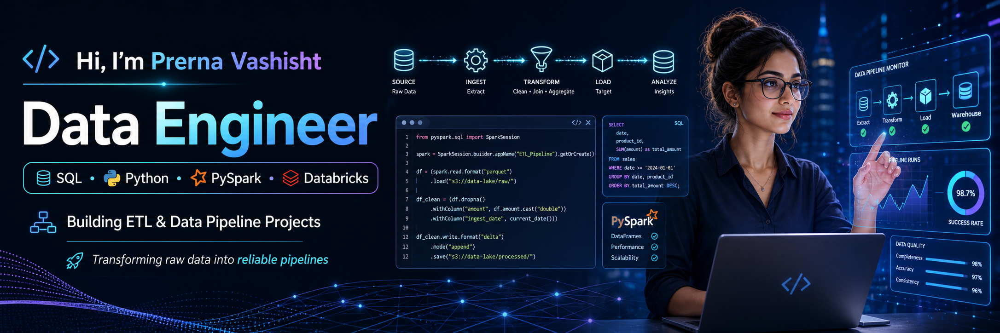

  

<h1 align="center">Hi, I'm Prerna Vashisht 👋</h1>

<h3 align="center">
Data Engineer | SQL • Python • PySpark • Databricks
</h3>

  

---

## 👩‍💻 About Me

- Data Engineer focused on **ETL pipelines, data ingestion, transformation, and structured data processing**
- Hands-on with **SQL, Python, PySpark, Apache Spark, and Databricks**
- Built practical projects around **API-based ingestion, Medallion Architecture, and pipeline development**
- Interested in building **clean, scalable, and reliable data workflows**
- Open to **Junior Data Engineer / Data Engineer** opportunities
- Immediate Joiner

---

## ⚒️ Tech Stack

  
  
  
  
  
  
  
  
  
  

---

## 🚀 Featured Projects

### 1) [Job Aggregation ETL Pipeline using PySpark and Databricks](https://github.com/PrernaVashisht999/Job-Aggregation-ETL-Pipeline-PySpark-Databricks)
- Built an end-to-end ETL pipeline to ingest and process **100+ job listings** from **SerpApi**
- Implemented **Bronze, Silver, and Gold** layers using **Medallion Architecture**
- Applied **deduplication, null handling, and schema standardization**
- Generated structured datasets for **hiring roles, companies, and location insights**

### 2) [Weather Data ETL Pipeline using PySpark and Databricks](https://github.com/PrernaVashisht999/Weather-Data-ETL-Pipeline-PySpark-Databricks)
- Built a PySpark-based ETL pipeline to ingest **API-driven weather data** from **RapidAPI**
- Processed weather attributes such as **temperature, humidity, cloud cover, and datetime fields**
- Applied **cleaning, filtering, validation, transformation, and aggregations**
- Used Databricks to transform semi-structured API data into structured outputs for trend identification

---

## 🌟 Highlights

- Built **2 hands-on Data Engineering projects**
- Worked with **API-based data ingestion**
- Practiced **PySpark transformations** and **Spark SQL**
- Implemented **Medallion Architecture**
- Built data workflows in **Databricks**
- Focused on **clean, structured, and reliable pipelines**

---

## 🏆 GitHub Trophies

  

---

## 📊 GitHub Stats

  
  

  

---

## 📈 Contribution Graph

  

---

## 📬 Connect

  
  

