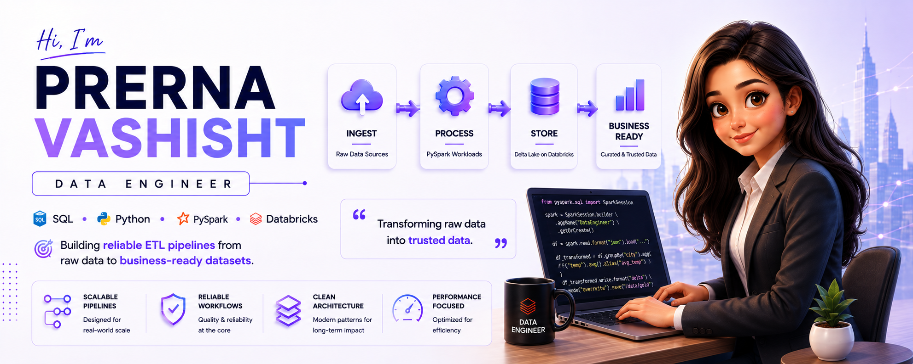

<p align="center">
  
</p>

<h1 align="center">
Hi 👋 I'm Prerna Vashisht
</h1>

<h3 align="center">
Data Engineer | SQL | Python | PySpark | Databricks
</h3>

<p align="center">
Building scalable data platforms • Engineering reliable pipelines • Designing efficient data processing workflows
</p>

<p align="center">

</p>

---

# 👩‍💻 About Me

I am a Data Engineer focused on designing scalable data systems, building reliable ETL pipelines, and developing efficient data processing workflows.

My engineering focus includes:

- End-to-end data pipeline development
- Data ingestion and transformation workflows
- PySpark-based distributed processing
- Data quality validation
- Data modeling and architecture patterns
- Building reliable data workflows

Core technologies:

- SQL
- Python
- PySpark
- Apache Spark
- Databricks

I enjoy solving complex data engineering challenges through optimized processing, clean engineering practices, and scalable architecture.

---

# 🛠️ Technical Stack

<p align="center">


</p>

<p align="center">


</p>

---

# 🚀 Featured Data Engineering Projects

## 🔹 Job Aggregation ETL Pipeline

An end-to-end data engineering pipeline designed to ingest external sources, transform raw information, apply validation rules, and create reliable data workflows using PySpark and Databricks.

### Engineering Highlights:

✔ API-driven data ingestion  
✔ PySpark transformation framework  
✔ Bronze → Silver → Gold architecture  
✔ Schema standardization  
✔ Data validation workflows  
✔ Scalable pipeline design  

Repository:

https://github.com/PrernaVashisht999/Job-Aggregation-ETL-Pipeline-PySpark-Databricks

---

## 🔹 Weather Data ETL Pipeline

A complete data engineering workflow designed to process external API sources through ingestion, transformation, validation, and structured delivery.

### Engineering Highlights:

✔ REST API ingestion  
✔ Distributed processing using PySpark  
✔ Databricks execution environment  
✔ Transformation workflows  
✔ Aggregation logic  
✔ Reliable pipeline architecture  

Repository:

https://github.com/PrernaVashisht999/Weather-Data-ETL-Pipeline-PySpark-Databricks

---

# 🏗️ Data Engineering Architecture

```
External Data Sources
          |
          ↓
    Data Ingestion Layer
          |
          ↓
 Transformation Layer
      (PySpark)
          |
          ↓
 Processing & Validation
          |
          ↓
 Reliable Data Systems
```

---

# ⚙️ Engineering Expertise

✔ ETL Pipeline Engineering  
✔ PySpark & Apache Spark Processing  
✔ Spark SQL  
✔ Data Modeling  
✔ Data Quality Engineering  
✔ Distributed Data Processing  
✔ Medallion Architecture  
✔ API-Based Data Integration  
✔ SQL Optimization  

---

# 📌 Engineering Philosophy

Building data systems with focus on:

• Reliability  
• Scalability  
• Maintainability  
• Performance  

---

# 📬 Let's Connect

<p align="center">

<a href="https://www.linkedin.com/in/prernavashisht">


</a>

<a href="https://mail.google.com/mail/?view=cm&fs=1&to=prerna.dataengineer@gmail.com">


</a>

</p>
